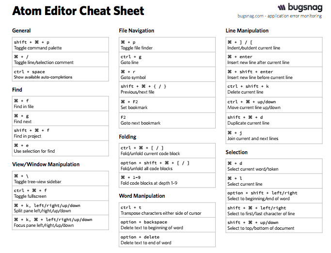

# keyboard-shortcuts

Command + Space → this will bring up your Spotlight

From here, type in ‘sys’, and hit enter. This will bring up your System Preferences on most Mac's.

Go to Trackpad, and hit the ‘Point and Click’ tab. Enable ‘Tap to Click’ to make your life easier. :-)

Demo:
	Command + S, Command + Option + S
	Command + A, Command + ← , →,  etc
	Command + D, Command + Control + G	::	select next//select all
	Multi-line Highlight tab// shift + tab	::	un/indent multiple lines
	Command + Control + up/down 	:: 	move line up//down
	Up, down, space, shift + space

Mac >> https://support.apple.com/en-us/HT201236

ShiftIt >>   examples..

??
